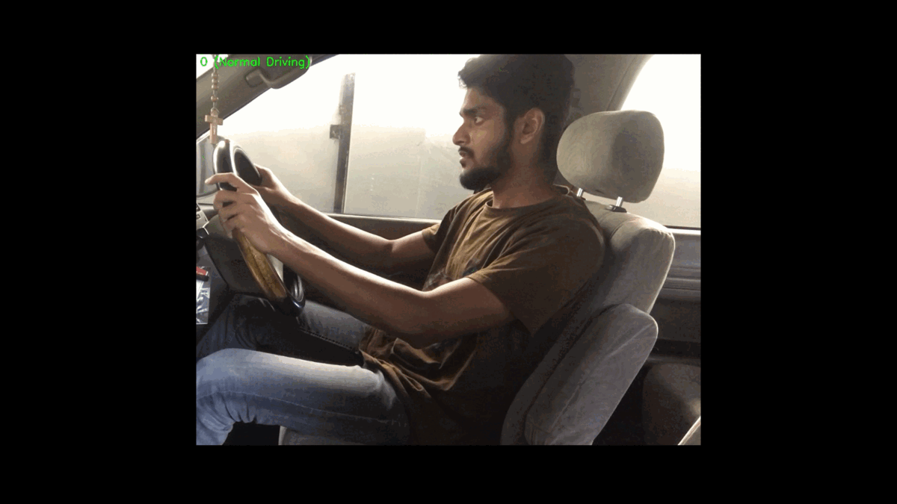
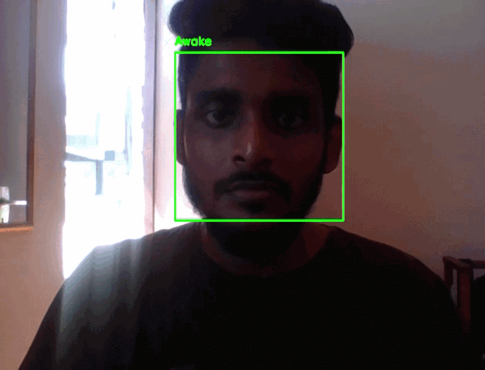

# Real-time Drowsiness and Distraction Detection System for Drivers




## Overview 🚀 🚗

This is a real-time Drowsiness and Distraction Detection System using transfer learning. It addresses critical concerns related to driver safety and attentiveness, particularly in the context of road safety and human-machine interaction. It detects the driver's eye state and recognizes various forms of distraction behaviors by analyzing real-time visual data, allowing for timely warnings and intervention.

## Datasets used 📊

**Drowsiness Detection Model:**
- MRL eye dataset
- Closed Eyes In The Wild (CEW) dataset
- ZJU eyeblink dataset

**Distraction Detection Model:**
- Statefarm driver distraction dataset (with manual label error correction)

## Novelty 🌟

One of the key highlights of this project is the use of a combined dataset that has not been used in any of the existing systems. This means that the model will be trained on a more diverse dataset, which could lead to improved performance.

## Getting Started

- Download the specified datasets.
- Download the jupyter notebook files and change the paths to the datasets, and other data in the code.
- Run...

Note: 
- Directories structures used to save the data also given, if needed you can change those structures. Make sure to update dataset and directory paths in the files.
- Trained model files (model file, model history, tflite (precision - float16) converted model) also given
- Reproducing results might not be possible - data were chosen randomly (Ex: subset of MRL is chosen for drowsiness detctection model)

## License 📜

This project is licensed under the MIT - see the [LICENSE.md](https://github.com/Justy-11/R4D/blob/988f3ce100134d355b0251eb3e851338114116f7/LICENSE) file for details.

## Keywords

Transfer Learning - Driver Monitoring System - Pre-trained Models - OpenCV - TensorFlow - NumPy - Matplotlib - Keras - Keras-tuner - Scikit-Learn - Deep Learning - Python (Programming Language) - Seaborn - tflite

## Folder structure 📁

```
R4D/
│
├── DrowsinessDetectionOnCombinedDataset/
│   ├── saved_data/    
|   |   ├── models/
|   |   |   └── model and history files
|   |   |
|   |   └──  saved .npy and .pkl image array files
|   | 
│   ├── tune_dir/
|   |  
│   ├── 01_Data_Preprocessing.ipynb
|   ├── 02_Model_Training.ipynb
|   ├── 03_Model_evaluation.ipynb
|   ├── 04_Realtime_detection.ipynb
│   └── ...
│
├── haarcascade_eye.xml
│
├── haarcascade_frontalface_default.xml
|
└── README.md, LICENSE
